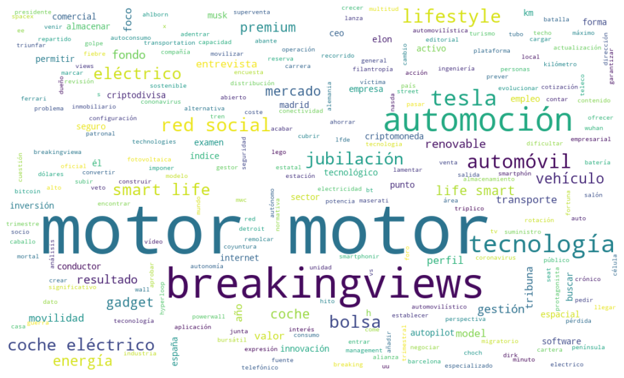
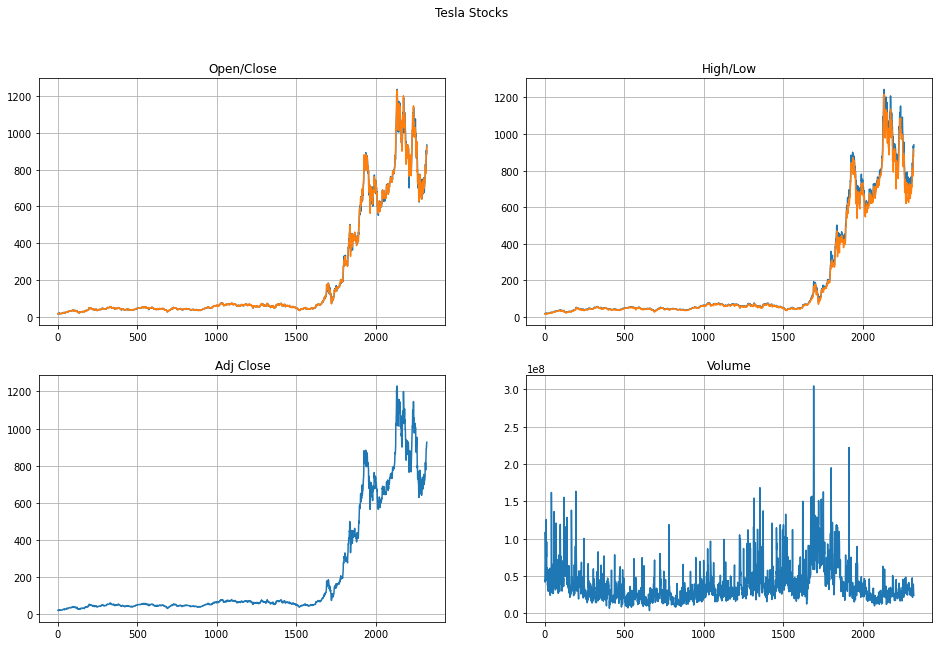
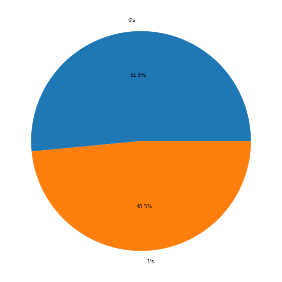
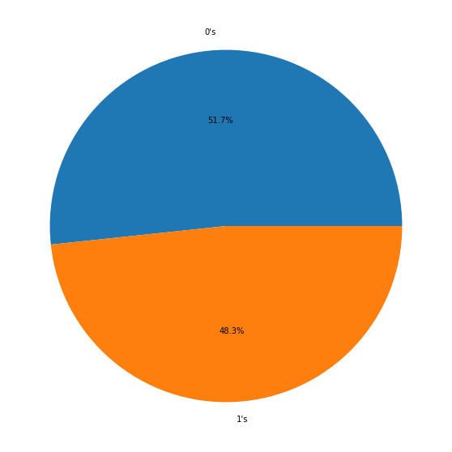

---
jupyter:
  kernelspec:
    display_name: Python 3.8.5 (\'base\')
    language: python
    name: python3
  language_info:
    codemirror_mode:
      name: ipython
      version: 3
    file_extension: .py
    mimetype: text/x-python
    name: python
    nbconvert_exporter: python
    pygments_lexer: ipython3
    version: 3.8.5
  nbformat: 4
  nbformat_minor: 2
  orig_nbformat: 4
  vscode:
    interpreter:
      hash: bf2d4fae2dd7f9d0a1cb92fe5a57ae32bb8cac3d6e2203bb2bd58a3e2ed832c0
---

::: {.cell .markdown}
# Descripción

Con el fin de generar un modelo predictivo para el valor de las acciones
de la compañía Tesla Motors, se analizará la relación entre las noticias
publicadas en la página \'El País\' sobre la compañía y el precio de la
misma. Se aplicará técnicas de procesamiento de lenguaje natural y se
mostrará la correlación para obtener un modelo de clasificación.

Enlace: <https://cincodias.elpais.com/tag/tesla_motors/>
:::

::: {.cell .markdown}
# Obtención de datos

El archivo `<b>`{=html}scrap.py`</b>`{=html} se encarga de obtener los
datos de noticias y guardarlos en un archivo separado por comas.

Los datos historicos sobre la compañía se obtienen de
<https://finance.yahoo.com/quote/TSLA/history?period1=1628207417&period2=1659743417&interval=1d&filter=history&frequency=1d&includeAdjustedClose=true>
.

De antemano se sabe que no hay datos faltantes en el conjunto.
:::

::: {.cell .markdown}
# Exploración
:::

::: {.cell .code execution_count="131"}
``` {.python}
import pandas as pd
import matplotlib.pyplot as plt
from wordcloud import WordCloud
from sklearn.impute import SimpleImputer
import numpy as np
import spacy
import re
import string
import seaborn as sns


plt.rcParams["figure.figsize"] = (16, 10)
df_news = pd.read_csv('Data/news_data.csv')
df_stocks = pd.read_csv('Data/TSLA.csv')

print(
    f'Estructura noticias: {df_news.shape}. Estructura stocks: {df_stocks.shape}')
df_news.head()
```

::: {.output .stream .stdout}
    Estructura noticias: (937, 4). Estructura stocks: (2322, 7)
:::

::: {.output .execute_result execution_count="131"}
```{=html}
<div>
<style scoped>
    .dataframe tbody tr th:only-of-type {
        vertical-align: middle;
    }

    .dataframe tbody tr th {
        vertical-align: top;
    }

    .dataframe thead th {
        text-align: right;
    }
</style>
<table border="1" class="dataframe">
  <thead>
    <tr style="text-align: right;">
      <th></th>
      <th>Titulo</th>
      <th>Texto</th>
      <th>Fecha</th>
      <th>Tipo</th>
    </tr>
  </thead>
  <tbody>
    <tr>
      <th>0</th>
      <td>Elon Musk cree que la inflación ha llegado a s...</td>
      <td>El consejero delegado de Tesla, Elon Musk, cre...</td>
      <td>/tag/fecha/20220805</td>
      <td>Junta General</td>
    </tr>
    <tr>
      <th>1</th>
      <td>Sorpresa: el Tesla Roadster podría ser present...</td>
      <td>En 2023 tenemos varias citas importantes con T...</td>
      <td>/tag/fecha/20220804</td>
      <td>Motor</td>
    </tr>
    <tr>
      <th>2</th>
      <td>Twitter involucra a los amigos de Elon Musk en...</td>
      <td>Twitter presiona en su querella contra Elon Mu...</td>
      <td>/tag/fecha/20220802</td>
      <td>Tecnología&gt;</td>
    </tr>
    <tr>
      <th>3</th>
      <td>Los CEO de Atlassian dan una lección valiosa a...</td>
      <td>¿Hasta qué punto deben los jefes multimillonar...</td>
      <td>/tag/fecha/20220802</td>
      <td>Breakingviews</td>
    </tr>
    <tr>
      <th>4</th>
      <td>El Tesla Model 3 ya no es el coche eléctrico m...</td>
      <td>En los últimos años, Tesla ha arrasado en vent...</td>
      <td>/tag/fecha/20220801</td>
      <td>Motor</td>
    </tr>
  </tbody>
</table>
</div>
```
:::
:::

::: {.cell .code execution_count="132"}
``` {.python}
def formato_fecha(fecha):
    # Convierte a formato aaaa-mm-dd
    fecha_ = fecha.replace(' ', '').split('/')
    fecha = fecha_[-1]
    year = fecha[:4]
    mes = fecha[4:6]
    dia = fecha[6:]
    return f'{year}-{mes}-{dia}'


df_news['Fecha'] = df_news['Fecha'].apply(formato_fecha)
f"Intervalo de entradas: {df_news['Fecha'].iloc[-1]}, {df_news['Fecha'].iloc[0]}"
```

::: {.output .execute_result execution_count="132"}
    'Intervalo de entradas: 2013-05-16, 2022-08-05'
:::
:::

::: {.cell .markdown}
## Pre-procesamiento

Se realiza para obtener más valor del texto y estandarizar.
:::

::: {.cell .code execution_count="133"}
``` {.python}
nlp = spacy.load("es_core_news_sm")
stopwords = spacy.lang.es.stop_words.STOP_WORDS


def normalize(comment, lowercase, remove_stopwords):
    try:
        comment = comment.lower()
    except:
        print(comment)
        return ''
    comment = re.sub('\[.*?\]', '', comment)
    comment = re.sub("\\W", " ", comment)
    comment = re.sub('https?://\S+|www\.\S+', '', comment)
    comment = re.sub('<.*?>+', '', comment)
    comment = re.sub('[%s]' % re.escape(string.punctuation), '', comment)
    comment = re.sub('\n', '', comment)
    comment = re.sub('\w*\d\w*', '', comment)
    if lowercase:
        comment = comment.lower()
    comment = nlp(comment)
    lemmatized = list()
    for word in comment:
        lemma = word.lemma_.strip()
        if lemma:
            if not remove_stopwords or (remove_stopwords and lemma not in stopwords):
                lemmatized.append(lemma)
    return " ".join(lemmatized)


df_news['Titulo'] = df_news['Titulo'].apply(
    normalize, lowercase=True, remove_stopwords=True)
df_news['Tipo'] = df_news['Tipo'].apply(
    normalize, lowercase=True, remove_stopwords=True)
df_news['Texto'] = df_news['Texto'].apply(
    normalize, lowercase=True, remove_stopwords=True)
```

::: {.output .stream .stdout}
    nan
    nan
    nan
:::
:::

::: {.cell .markdown}
## Distribución del tipo de notas
:::

::: {.cell .code execution_count="134"}
``` {.python}
text = ''
for data in df_news['Tipo']:
    text += f'{data} '

word_cloud = WordCloud(background_color="white",
                       max_words=350,
                       width=1000,
                       height=600,
                       random_state=1).generate(text[:-2])
plt.imshow(word_cloud, interpolation='bilinear')
plt.axis('off')
```

::: {.output .execute_result execution_count="134"}
    (-0.5, 999.5, 599.5, -0.5)
:::

::: {.output .display_data}

:::
:::

::: {.cell .markdown}
## Visualización de los stocks de Tesla
:::

::: {.cell .code execution_count="135"}
``` {.python}
fig, ax = plt.subplots(2, 2)
fig.suptitle('Tesla Stocks')

ax[0, 0].plot(df_stocks.index, df_stocks['Open'])
ax[0, 0].plot(df_stocks.index, df_stocks['Close'])
ax[0, 0].set_title('Open/Close')
ax[0, 0].grid()

ax[0, 1].plot(df_stocks.index, df_stocks['High'])
ax[0, 1].plot(df_stocks.index, df_stocks['Low'])
ax[0, 1].set_title('High/Low')
ax[0, 1].grid()

ax[1, 0].plot(df_stocks.index, df_stocks['Adj Close'])
ax[1, 0].set_title('Adj Close')
ax[1, 0].grid()

ax[1, 1].plot(df_stocks.index, df_stocks['Volume'])
ax[1, 1].set_title('Volume')
ax[1, 1].grid()
```

::: {.output .display_data}

:::
:::

::: {.cell .code execution_count="136"}
``` {.python}
def set_target(open, close):
    if close - open > 0:
        return 1
    else:
        return 0


def set_volume(volume, mean):
    if volume > mean:
        return 1
    else:
        return 0


mean_volume = df_stocks.mean()['Volume']
df_stocks['Change'] = df_stocks.apply(
    lambda x: set_target(x['Open'], x['Close']), axis=1)
df_stocks['Volume'] = df_stocks.apply(
    lambda x: set_volume(x['Volume'], mean_volume), axis=1)
df_stocks = df_stocks.drop(['Open', 'Close', 'Adj Close'], axis=1)
```
:::

::: {.cell .markdown}
## Se juntarán las notas con la misma fecha
:::

::: {.cell .code execution_count="137"}
``` {.python}
def most_frequent(List):
    return max(set(List), key = List.count)

aux = df_news.groupby('Fecha')
notas, tipo, fechas = [], [], []
for fecha in df_news['Fecha'].unique():
    nota = ''
    aux_tipo = []
    for text, tipe in zip(aux.get_group(fecha)['Texto'], aux.get_group(fecha)['Tipo']):
        nota += str(text)
        aux_tipo.append(tipe)

    tipo.append(most_frequent(aux_tipo))
    notas.append(nota)
    fechas.append(fecha)
df_news = pd.DataFrame({'Texto': notas, 'Fecha': fechas, 'Tipo': tipo})
```
:::

::: {.cell .code execution_count="138"}
``` {.python}
df_news['Cambio'] = df_news['Fecha'].map(df_stocks.set_index('Date')['Change'])
df_news['Volumen'] = df_news['Fecha'].map(
    df_stocks.set_index('Date')['Volume'])
    
df_news['Maximo'] = df_news['Fecha'].map(df_stocks.set_index('Date')['High'])
df_news['Minimo'] = df_news['Fecha'].map(df_stocks.set_index('Date')['Low'])
df_news = df_news.drop(['Fecha'], axis=1)
print(df_news.shape)
df_news.head()
```

::: {.output .stream .stdout}
    (751, 6)
:::

::: {.output .execute_result execution_count="138"}
```{=html}
<div>
<style scoped>
    .dataframe tbody tr th:only-of-type {
        vertical-align: middle;
    }

    .dataframe tbody tr th {
        vertical-align: top;
    }

    .dataframe thead th {
        text-align: right;
    }
</style>
<table border="1" class="dataframe">
  <thead>
    <tr style="text-align: right;">
      <th></th>
      <th>Texto</th>
      <th>Tipo</th>
      <th>Cambio</th>
      <th>Volumen</th>
      <th>Maximo</th>
      <th>Minimo</th>
    </tr>
  </thead>
  <tbody>
    <tr>
      <th>0</th>
      <td>consejero delegado tesla elon musk creer infla...</td>
      <td>junta general</td>
      <td>NaN</td>
      <td>NaN</td>
      <td>NaN</td>
      <td>NaN</td>
    </tr>
    <tr>
      <th>1</th>
      <td>cita importante tesla año elegido fabricante l...</td>
      <td>motor</td>
      <td>0.0</td>
      <td>0.0</td>
      <td>940.820007</td>
      <td>915.000000</td>
    </tr>
    <tr>
      <th>2</th>
      <td>twitter presionar querella elon musk buscar ex...</td>
      <td>tecnología</td>
      <td>1.0</td>
      <td>0.0</td>
      <td>923.500000</td>
      <td>878.000000</td>
    </tr>
    <tr>
      <th>3</th>
      <td>año tesla arrasar venta gigante motor eléctric...</td>
      <td>motor</td>
      <td>0.0</td>
      <td>1.0</td>
      <td>935.630005</td>
      <td>885.000000</td>
    </tr>
    <tr>
      <th>4</th>
      <td>coche eléctrico esperado tesla cybertruck vehí...</td>
      <td>motor</td>
      <td>1.0</td>
      <td>0.0</td>
      <td>827.780029</td>
      <td>785.369995</td>
    </tr>
  </tbody>
</table>
</div>
```
:::
:::

::: {.cell .code execution_count="139"}
``` {.python}
print(df_news.isnull().sum())
df_news = df_news.dropna(axis=0)
```

::: {.output .stream .stdout}
    Texto       0
    Tipo        0
    Cambio     58
    Volumen    58
    Maximo     58
    Minimo     58
    dtype: int64
:::
:::

::: {.cell .code execution_count="140"}
``` {.python}
a = df_news[df_news['Cambio'] == 0].value_counts('Cambio')[0]
b = df_news.shape[0] - a

plt.pie([a,b], labels=["0's","1's"], autopct='%1.1f%%')
plt.show()
```

::: {.output .display_data}

:::
:::

::: {.cell .code execution_count="141"}
``` {.python}
from sklearn.feature_extraction.text import TfidfVectorizer
from sklearn.ensemble import RandomForestClassifier
from xgboost import XGBClassifier
from sklearn.model_selection import train_test_split
from sklearn.pipeline import Pipeline
from sklearn.model_selection import cross_val_score
V = TfidfVectorizer()
RFR = RandomForestClassifier(max_depth=10, random_state=0)
XGBR = XGBClassifier(n_estimators=800, learning_rate = 0.05)
```
:::

::: {.cell .markdown}
## Prueba uno
:::

::: {.cell .code execution_count="142"}
``` {.python}
X_train, X_test, y_train, y_test = train_test_split(
    df_news['Texto'], df_news['Volumen'], random_state=0)
XV_train = V.fit_transform(raw_documents=X_train)
XV_test = V.transform(X_test)
RFR.fit(XV_train, y_train)
```

::: {.output .execute_result execution_count="142"}
```{=html}
<style>#sk-container-id-9 {color: black;background-color: white;}#sk-container-id-9 pre{padding: 0;}#sk-container-id-9 div.sk-toggleable {background-color: white;}#sk-container-id-9 label.sk-toggleable__label {cursor: pointer;display: block;width: 100%;margin-bottom: 0;padding: 0.3em;box-sizing: border-box;text-align: center;}#sk-container-id-9 label.sk-toggleable__label-arrow:before {content: "▸";float: left;margin-right: 0.25em;color: #696969;}#sk-container-id-9 label.sk-toggleable__label-arrow:hover:before {color: black;}#sk-container-id-9 div.sk-estimator:hover label.sk-toggleable__label-arrow:before {color: black;}#sk-container-id-9 div.sk-toggleable__content {max-height: 0;max-width: 0;overflow: hidden;text-align: left;background-color: #f0f8ff;}#sk-container-id-9 div.sk-toggleable__content pre {margin: 0.2em;color: black;border-radius: 0.25em;background-color: #f0f8ff;}#sk-container-id-9 input.sk-toggleable__control:checked~div.sk-toggleable__content {max-height: 200px;max-width: 100%;overflow: auto;}#sk-container-id-9 input.sk-toggleable__control:checked~label.sk-toggleable__label-arrow:before {content: "▾";}#sk-container-id-9 div.sk-estimator input.sk-toggleable__control:checked~label.sk-toggleable__label {background-color: #d4ebff;}#sk-container-id-9 div.sk-label input.sk-toggleable__control:checked~label.sk-toggleable__label {background-color: #d4ebff;}#sk-container-id-9 input.sk-hidden--visually {border: 0;clip: rect(1px 1px 1px 1px);clip: rect(1px, 1px, 1px, 1px);height: 1px;margin: -1px;overflow: hidden;padding: 0;position: absolute;width: 1px;}#sk-container-id-9 div.sk-estimator {font-family: monospace;background-color: #f0f8ff;border: 1px dotted black;border-radius: 0.25em;box-sizing: border-box;margin-bottom: 0.5em;}#sk-container-id-9 div.sk-estimator:hover {background-color: #d4ebff;}#sk-container-id-9 div.sk-parallel-item::after {content: "";width: 100%;border-bottom: 1px solid gray;flex-grow: 1;}#sk-container-id-9 div.sk-label:hover label.sk-toggleable__label {background-color: #d4ebff;}#sk-container-id-9 div.sk-serial::before {content: "";position: absolute;border-left: 1px solid gray;box-sizing: border-box;top: 0;bottom: 0;left: 50%;z-index: 0;}#sk-container-id-9 div.sk-serial {display: flex;flex-direction: column;align-items: center;background-color: white;padding-right: 0.2em;padding-left: 0.2em;position: relative;}#sk-container-id-9 div.sk-item {position: relative;z-index: 1;}#sk-container-id-9 div.sk-parallel {display: flex;align-items: stretch;justify-content: center;background-color: white;position: relative;}#sk-container-id-9 div.sk-item::before, #sk-container-id-9 div.sk-parallel-item::before {content: "";position: absolute;border-left: 1px solid gray;box-sizing: border-box;top: 0;bottom: 0;left: 50%;z-index: -1;}#sk-container-id-9 div.sk-parallel-item {display: flex;flex-direction: column;z-index: 1;position: relative;background-color: white;}#sk-container-id-9 div.sk-parallel-item:first-child::after {align-self: flex-end;width: 50%;}#sk-container-id-9 div.sk-parallel-item:last-child::after {align-self: flex-start;width: 50%;}#sk-container-id-9 div.sk-parallel-item:only-child::after {width: 0;}#sk-container-id-9 div.sk-dashed-wrapped {border: 1px dashed gray;margin: 0 0.4em 0.5em 0.4em;box-sizing: border-box;padding-bottom: 0.4em;background-color: white;}#sk-container-id-9 div.sk-label label {font-family: monospace;font-weight: bold;display: inline-block;line-height: 1.2em;}#sk-container-id-9 div.sk-label-container {text-align: center;}#sk-container-id-9 div.sk-container {/* jupyter's `normalize.less` sets `[hidden] { display: none; }` but bootstrap.min.css set `[hidden] { display: none !important; }` so we also need the `!important` here to be able to override the default hidden behavior on the sphinx rendered scikit-learn.org. See: https://github.com/scikit-learn/scikit-learn/issues/21755 */display: inline-block !important;position: relative;}#sk-container-id-9 div.sk-text-repr-fallback {display: none;}</style><div id="sk-container-id-9" class="sk-top-container"><div class="sk-text-repr-fallback"><pre>RandomForestClassifier(max_depth=10, random_state=0)</pre><b>In a Jupyter environment, please rerun this cell to show the HTML representation or trust the notebook. <br />On GitHub, the HTML representation is unable to render, please try loading this page with nbviewer.org.</b></div><div class="sk-container" hidden><div class="sk-item"><div class="sk-estimator sk-toggleable"><input class="sk-toggleable__control sk-hidden--visually" id="sk-estimator-id-9" type="checkbox" checked><label for="sk-estimator-id-9" class="sk-toggleable__label sk-toggleable__label-arrow">RandomForestClassifier</label><div class="sk-toggleable__content"><pre>RandomForestClassifier(max_depth=10, random_state=0)</pre></div></div></div></div></div>
```
:::
:::

::: {.cell .code execution_count="143"}
``` {.python}
predict_1 = RFR.predict(XV_test)
score = RFR.score(XV_test, y_test)
print(f'Puntuación: {score}')
```

::: {.output .stream .stdout}
    Puntuación: 0.6724137931034483
:::
:::

::: {.cell .code execution_count="144"}
``` {.python}
XGBR.fit(XV_train, y_train)
predict_2 = XGBR.predict(XV_test)
score = XGBR.score(XV_test, y_test)
print(f'Puntuación: {score}')
```

::: {.output .stream .stdout}
    Puntuación: 0.6206896551724138
:::
:::

::: {.cell .code execution_count="145"}
``` {.python}
df_predict = pd.DataFrame({
    'Matrix': X_test,
    'Volume': y_test,
    'Predict uno': predict_1,
    'Predict dos': predict_2
})
df_predict.head()
```

::: {.output .execute_result execution_count="145"}
```{=html}
<div>
<style scoped>
    .dataframe tbody tr th:only-of-type {
        vertical-align: middle;
    }

    .dataframe tbody tr th {
        vertical-align: top;
    }

    .dataframe thead th {
        text-align: right;
    }
</style>
<table border="1" class="dataframe">
  <thead>
    <tr style="text-align: right;">
      <th></th>
      <th>Matrix</th>
      <th>Volume</th>
      <th>Predict uno</th>
      <th>Predict dos</th>
    </tr>
  </thead>
  <tbody>
    <tr>
      <th>498</th>
      <td>firma elon musk camino tesla roadster presenta...</td>
      <td>1.0</td>
      <td>0.0</td>
      <td>1</td>
    </tr>
    <tr>
      <th>162</th>
      <td>tiempo mala venta tesla temer pérdida lunes pr...</td>
      <td>0.0</td>
      <td>1.0</td>
      <td>1</td>
    </tr>
    <tr>
      <th>652</th>
      <td>consejero delegado tesla elon musk anunciar ju...</td>
      <td>0.0</td>
      <td>0.0</td>
      <td>0</td>
    </tr>
    <tr>
      <th>630</th>
      <td>recarga coche eléctrico característica tecnolo...</td>
      <td>0.0</td>
      <td>0.0</td>
      <td>0</td>
    </tr>
    <tr>
      <th>396</th>
      <td>invento pasar año cumplir inamovible parecer c...</td>
      <td>0.0</td>
      <td>0.0</td>
      <td>0</td>
    </tr>
  </tbody>
</table>
</div>
```
:::
:::

::: {.cell .markdown}
## Prueba 2
:::

::: {.cell .code execution_count="146"}
``` {.python}
X_train, X_test, y_train, y_test = train_test_split(
    df_news['Texto'], df_news['Cambio'], random_state=0)
XV_train = V.fit_transform(raw_documents=X_train)
XV_test = V.transform(X_test)
RFR.fit(XV_train, y_train)
```

::: {.output .execute_result execution_count="146"}
```{=html}
<style>#sk-container-id-10 {color: black;background-color: white;}#sk-container-id-10 pre{padding: 0;}#sk-container-id-10 div.sk-toggleable {background-color: white;}#sk-container-id-10 label.sk-toggleable__label {cursor: pointer;display: block;width: 100%;margin-bottom: 0;padding: 0.3em;box-sizing: border-box;text-align: center;}#sk-container-id-10 label.sk-toggleable__label-arrow:before {content: "▸";float: left;margin-right: 0.25em;color: #696969;}#sk-container-id-10 label.sk-toggleable__label-arrow:hover:before {color: black;}#sk-container-id-10 div.sk-estimator:hover label.sk-toggleable__label-arrow:before {color: black;}#sk-container-id-10 div.sk-toggleable__content {max-height: 0;max-width: 0;overflow: hidden;text-align: left;background-color: #f0f8ff;}#sk-container-id-10 div.sk-toggleable__content pre {margin: 0.2em;color: black;border-radius: 0.25em;background-color: #f0f8ff;}#sk-container-id-10 input.sk-toggleable__control:checked~div.sk-toggleable__content {max-height: 200px;max-width: 100%;overflow: auto;}#sk-container-id-10 input.sk-toggleable__control:checked~label.sk-toggleable__label-arrow:before {content: "▾";}#sk-container-id-10 div.sk-estimator input.sk-toggleable__control:checked~label.sk-toggleable__label {background-color: #d4ebff;}#sk-container-id-10 div.sk-label input.sk-toggleable__control:checked~label.sk-toggleable__label {background-color: #d4ebff;}#sk-container-id-10 input.sk-hidden--visually {border: 0;clip: rect(1px 1px 1px 1px);clip: rect(1px, 1px, 1px, 1px);height: 1px;margin: -1px;overflow: hidden;padding: 0;position: absolute;width: 1px;}#sk-container-id-10 div.sk-estimator {font-family: monospace;background-color: #f0f8ff;border: 1px dotted black;border-radius: 0.25em;box-sizing: border-box;margin-bottom: 0.5em;}#sk-container-id-10 div.sk-estimator:hover {background-color: #d4ebff;}#sk-container-id-10 div.sk-parallel-item::after {content: "";width: 100%;border-bottom: 1px solid gray;flex-grow: 1;}#sk-container-id-10 div.sk-label:hover label.sk-toggleable__label {background-color: #d4ebff;}#sk-container-id-10 div.sk-serial::before {content: "";position: absolute;border-left: 1px solid gray;box-sizing: border-box;top: 0;bottom: 0;left: 50%;z-index: 0;}#sk-container-id-10 div.sk-serial {display: flex;flex-direction: column;align-items: center;background-color: white;padding-right: 0.2em;padding-left: 0.2em;position: relative;}#sk-container-id-10 div.sk-item {position: relative;z-index: 1;}#sk-container-id-10 div.sk-parallel {display: flex;align-items: stretch;justify-content: center;background-color: white;position: relative;}#sk-container-id-10 div.sk-item::before, #sk-container-id-10 div.sk-parallel-item::before {content: "";position: absolute;border-left: 1px solid gray;box-sizing: border-box;top: 0;bottom: 0;left: 50%;z-index: -1;}#sk-container-id-10 div.sk-parallel-item {display: flex;flex-direction: column;z-index: 1;position: relative;background-color: white;}#sk-container-id-10 div.sk-parallel-item:first-child::after {align-self: flex-end;width: 50%;}#sk-container-id-10 div.sk-parallel-item:last-child::after {align-self: flex-start;width: 50%;}#sk-container-id-10 div.sk-parallel-item:only-child::after {width: 0;}#sk-container-id-10 div.sk-dashed-wrapped {border: 1px dashed gray;margin: 0 0.4em 0.5em 0.4em;box-sizing: border-box;padding-bottom: 0.4em;background-color: white;}#sk-container-id-10 div.sk-label label {font-family: monospace;font-weight: bold;display: inline-block;line-height: 1.2em;}#sk-container-id-10 div.sk-label-container {text-align: center;}#sk-container-id-10 div.sk-container {/* jupyter's `normalize.less` sets `[hidden] { display: none; }` but bootstrap.min.css set `[hidden] { display: none !important; }` so we also need the `!important` here to be able to override the default hidden behavior on the sphinx rendered scikit-learn.org. See: https://github.com/scikit-learn/scikit-learn/issues/21755 */display: inline-block !important;position: relative;}#sk-container-id-10 div.sk-text-repr-fallback {display: none;}</style><div id="sk-container-id-10" class="sk-top-container"><div class="sk-text-repr-fallback"><pre>RandomForestClassifier(max_depth=10, random_state=0)</pre><b>In a Jupyter environment, please rerun this cell to show the HTML representation or trust the notebook. <br />On GitHub, the HTML representation is unable to render, please try loading this page with nbviewer.org.</b></div><div class="sk-container" hidden><div class="sk-item"><div class="sk-estimator sk-toggleable"><input class="sk-toggleable__control sk-hidden--visually" id="sk-estimator-id-10" type="checkbox" checked><label for="sk-estimator-id-10" class="sk-toggleable__label sk-toggleable__label-arrow">RandomForestClassifier</label><div class="sk-toggleable__content"><pre>RandomForestClassifier(max_depth=10, random_state=0)</pre></div></div></div></div></div>
```
:::
:::

::: {.cell .code execution_count="147"}
``` {.python}
predict = RFR.predict(XV_test)
score = RFR.score(XV_test, y_test)
print(f'Puntuación: {score}')
```

::: {.output .stream .stdout}
    Puntuación: 0.5747126436781609
:::
:::

::: {.cell .code execution_count="148"}
``` {.python}
df_predict = pd.DataFrame({
    'Matrix': X_test,
    'Cambio': y_test,
    'Predict': predict
})
df_predict.head()
```

::: {.output .execute_result execution_count="148"}
```{=html}
<div>
<style scoped>
    .dataframe tbody tr th:only-of-type {
        vertical-align: middle;
    }

    .dataframe tbody tr th {
        vertical-align: top;
    }

    .dataframe thead th {
        text-align: right;
    }
</style>
<table border="1" class="dataframe">
  <thead>
    <tr style="text-align: right;">
      <th></th>
      <th>Matrix</th>
      <th>Cambio</th>
      <th>Predict</th>
    </tr>
  </thead>
  <tbody>
    <tr>
      <th>498</th>
      <td>firma elon musk camino tesla roadster presenta...</td>
      <td>0.0</td>
      <td>0.0</td>
    </tr>
    <tr>
      <th>162</th>
      <td>tiempo mala venta tesla temer pérdida lunes pr...</td>
      <td>0.0</td>
      <td>0.0</td>
    </tr>
    <tr>
      <th>652</th>
      <td>consejero delegado tesla elon musk anunciar ju...</td>
      <td>0.0</td>
      <td>1.0</td>
    </tr>
    <tr>
      <th>630</th>
      <td>recarga coche eléctrico característica tecnolo...</td>
      <td>0.0</td>
      <td>0.0</td>
    </tr>
    <tr>
      <th>396</th>
      <td>invento pasar año cumplir inamovible parecer c...</td>
      <td>0.0</td>
      <td>1.0</td>
    </tr>
  </tbody>
</table>
</div>
```
:::
:::

::: {.cell .markdown}
# Pruebas cross validation
:::

::: {.cell .code execution_count="149"}
``` {.python}
df_aux = df_news[df_news['Tipo']=='motor']
print(df_aux.shape)
df_aux.head()
```

::: {.output .stream .stdout}
    (445, 6)
:::

::: {.output .execute_result execution_count="149"}
```{=html}
<div>
<style scoped>
    .dataframe tbody tr th:only-of-type {
        vertical-align: middle;
    }

    .dataframe tbody tr th {
        vertical-align: top;
    }

    .dataframe thead th {
        text-align: right;
    }
</style>
<table border="1" class="dataframe">
  <thead>
    <tr style="text-align: right;">
      <th></th>
      <th>Texto</th>
      <th>Tipo</th>
      <th>Cambio</th>
      <th>Volumen</th>
      <th>Maximo</th>
      <th>Minimo</th>
    </tr>
  </thead>
  <tbody>
    <tr>
      <th>1</th>
      <td>cita importante tesla año elegido fabricante l...</td>
      <td>motor</td>
      <td>0.0</td>
      <td>0.0</td>
      <td>940.820007</td>
      <td>915.000000</td>
    </tr>
    <tr>
      <th>3</th>
      <td>año tesla arrasar venta gigante motor eléctric...</td>
      <td>motor</td>
      <td>0.0</td>
      <td>1.0</td>
      <td>935.630005</td>
      <td>885.000000</td>
    </tr>
    <tr>
      <th>4</th>
      <td>coche eléctrico esperado tesla cybertruck vehí...</td>
      <td>motor</td>
      <td>1.0</td>
      <td>0.0</td>
      <td>827.780029</td>
      <td>785.369995</td>
    </tr>
    <tr>
      <th>8</th>
      <td>mejora preparar tesla coche mejora entretenimi...</td>
      <td>motor</td>
      <td>0.0</td>
      <td>0.0</td>
      <td>751.549988</td>
      <td>718.809998</td>
    </tr>
    <tr>
      <th>13</th>
      <td>volkswagir año líder indiscutible sector moda ...</td>
      <td>motor</td>
      <td>0.0</td>
      <td>0.0</td>
      <td>756.210022</td>
      <td>727.700012</td>
    </tr>
  </tbody>
</table>
</div>
```
:::
:::

::: {.cell .code execution_count="150"}
``` {.python}
a = df_aux[df_aux['Cambio'] == 0].value_counts('Cambio')[0]
b = df_aux.shape[0] - a

plt.pie([a,b], labels=["0's","1's"], autopct='%1.1f%%')
plt.show()
```

::: {.output .display_data}

:::
:::

::: {.cell .markdown}
## Prueba uno {#prueba-uno}
:::

::: {.cell .code execution_count="151"}
``` {.python}
clf = Pipeline(steps=[
    ('vect', TfidfVectorizer()),
    ('model', RandomForestClassifier(
        n_estimators=50,
        max_depth=10, 
        random_state=0
        ))
])
scores = cross_val_score(clf, df_news['Texto'], df_news['Cambio'],
                              cv=5,scoring='accuracy')
print("Scores:\n", scores)
```

::: {.output .stream .stdout}
    Scores:
     [0.4676259  0.48201439 0.50359712 0.54347826 0.47826087]
:::
:::

::: {.cell .code execution_count="152"}
``` {.python}
clf = Pipeline(steps=[
    ('vect', TfidfVectorizer()),
    ('model', XGBClassifier(n_estimators=800, learning_rate = 0.05))
])
scores = cross_val_score(clf, df_news['Texto'], df_news['Cambio'],
                              cv=5,scoring='accuracy')
print("Scores:\n", scores)
```

::: {.output .stream .stdout}
    Scores:
     [0.43884892 0.49640288 0.50359712 0.48550725 0.50724638]
:::
:::

::: {.cell .markdown}
## Prueba dos
:::

::: {.cell .code execution_count="153"}
``` {.python}
clf = Pipeline(steps=[
    ('vect', TfidfVectorizer()),
    ('model', RandomForestClassifier(
        n_estimators=50,
        max_depth=10, 
        random_state=0
        ))
])
scores = cross_val_score(clf, df_aux['Texto'], df_aux['Cambio'],
                              cv=5,scoring='accuracy')
print("Scores:\n", scores)
```

::: {.output .stream .stdout}
    Scores:
     [0.40449438 0.41573034 0.34831461 0.61797753 0.47191011]
:::
:::

::: {.cell .code execution_count="154"}
``` {.python}
clf = Pipeline(steps=[
    ('vect', TfidfVectorizer()),
    ('model', XGBClassifier(n_estimators=800, learning_rate = 0.05))
])
scores = cross_val_score(clf, df_aux['Texto'], df_aux['Cambio'],
                              cv=5,scoring='accuracy')
print("Scores:\n", scores)
```

::: {.output .stream .stdout}
    Scores:
     [0.4494382  0.43820225 0.4494382  0.38202247 0.51685393]
:::
:::

::: {.cell .markdown}
# Conclusión

Por desgracia no existe una relación significativa entre el texto y el
cambio presente en el valor de las acciones.

Es probable obtener un mejor resultado si para cada fecha existe al
menos una noticia, es decir, un conjunto de datos más homogéneo. Hay que
tener en cuenta que este proyecto no es dirigido a generar un modelo que
prediga el cambio en las acciones, pues está orientado a observar una
posible relación entre las noticias y el cambio; ya que el orden de la
obtención de los datos en un entorno real es diferente al realizado
aquí.
:::
